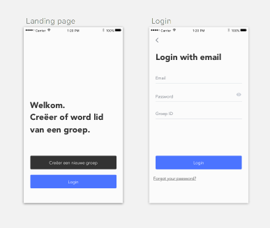
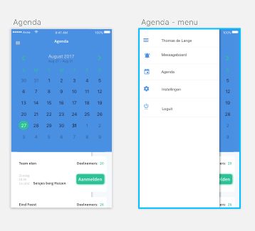
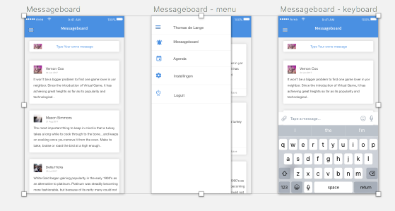

# GroupM8 Design Doc

Ik laat hieronder kort zien hoe het project vorm gaat krijgen, t.a.v. gebruik
van cocoapods en de Firebase noSQL database.

## Inlogscherm

De gebruiker word gewoon met de firebase user optie aangemeld. Als dit lukt dan wordt er gekeken of de gebruiker ook bij de groep zit die hij heeft ingevoerd. Na een keer inloggen gaat de app deze data waarschijnlijk opslaan zodat bij het opnieuw opstarten dit scherm over geslagen kan worden.

## Agenda

Er is een CocoaPod, JTAppleCalendar die de agenda maakt als view. De evenementen kunnen van en naar een server worden gestuurd als dict objecten. Het idee is dat alleen de administrator de keuze heeft een evenement aan te maken.

## Messageboard

Het makkelijkste lijkt mij om de berichten op te slaan in de database zonder tussenkomst van een extensie. Maar als dit niet lukt is er nog MessageKit. Er is een actieve listener die real-time berichten op kan halen (firebaseCore).

## Programmatic design

| View          | classes            | functions           | APIs and frameworks|
| --------------|--------------------| --------------------|--------------------|
| Inlogscherm   |  UIViewController     | loginAction, loginFail, textFieldShouldReturn, getGroup|UIKIT, [FirebaseAuth](https://firebase.google.com/docs/auth/), Firebase|
| Agenda        |UICollectionView|configureCalendar, calendar, setupCalendarView, extention ViewController -> getServerEvents|[JTAppleCallender](https://cocoapods.org/pods/JTAppleCalendar)|
| Messageboard  |UITableViewController | SendMessage, GetMessage| De Firebase [database](https://firebase.google.com/docs/auth/) of [MessageKit](https://cocoapods.org/pods/MessageKit)|

## Database Design

Het is een noSQL database dus er wordt gewerkt zonder schema. Alles is een string behalve de options. Ik Denk dat ik hier een Dictionary van ga maken. Er zouden eventueel wat extra velden kunnen komen. Maar over het algemeen zal de structuur niet veranderen.

"Users"
 - "IDUserOne"
   - name: "Thomas"
   - bDay: "6 jul"
   - options: {}
   - mail: "delange.thomas@gmail.com"
 - "IDUserTwo"
   - ...

"Groups"
- "IDGroupOne"
 - "Members"
   - "delange.thomas@gmail.com"
   - "UserTwoMail"
 - "Messages"
   - "0"
     - date: "10 jan"
	 - data: "hello world"
	 - name: "userName"
   - "1"
     - ...
	 - ...
	 - ...
