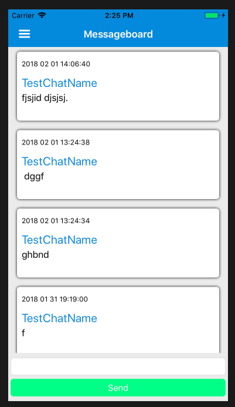

# GroupM8

GroupM8 is de hulp voor iedere groep, verenging of organisatie die persoonlijk contact wil met groepsleden, maar dan makkelijk. Het onderhouden van de rekening het sturen van een mail, het controleren op aanwezigheid. Allemaal problemen die in afzonderlijk opgelost moeten worden, tot nu.

## Problem statement

Het maakt het voor iedereen mogelijk een groep mensen op de hoogte te houden van activiteiten in de agenda, berichten te sturen, in informatie te voorzien en contributie te innen.

Denk aan een voetbalteam, studie verenging of gewoon je vriendengroep. Het effectief bijhouden van een ledenbestand kan vervelend werk zijn. Er moet gelet worden op de financiën, iemand moet de agenda bijhouden en iedereen hiervan op de hoogste te stellen en dan hebben we het nog niet over het bijhouden van de presentie lijst of het hebben van een groepsapp.

## Solution

Het bijhouden van een leden bestand en deze berichten sturen gaat gemakkelijk via de app. Bij het aanmelden wordt er gevraagd of iemand een groep wil maken of bij een bestaande groep wil aanmelden. Het is hierna nog mogelijk van groep te wisselen door naar instellingen te gaan.

Na het inloggen is er een chatbox zichtbaar waar idereen algemene berichten kan sturen. Het tweede onderdeel is dan de agenda. De beheerder kan items toevoegen. Dit gaat met behulp van een [package](https://cocoapods.org/pods/JTAppleCalendar). Het is tezien hoeveel mensen zich hebben aangemeld voor een event. In de agenda.

En tot slot is er de chatbox functie waar met elkaar gepraat kan worden over, de koetjes en de kalfjes.

Kortom de “fun” van een groep, zonder de administratieve problemen.

De icons zijn van [Flaticon](https://www.flaticon.com) en [swifticons](https://www.swifticons.com).
De licence van dit project is op dit momend 
De slider is ook extern bedacht door [John-Lluch](https://github.com/John-Lluch/SWRevealViewController).

## Screenshots van de app.

### Inlogscherm en registratie

### Algemene Functies

### Menu

