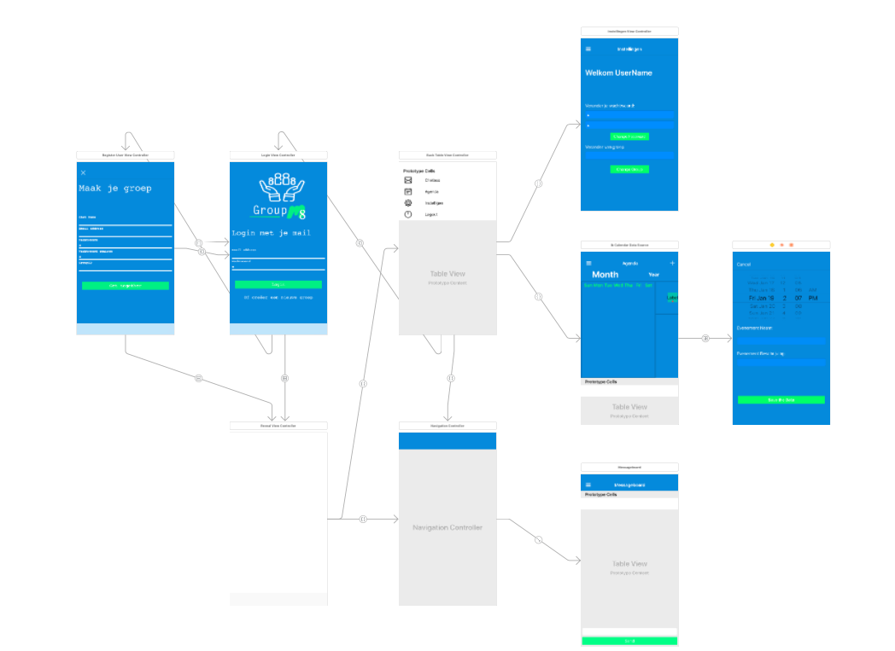

# GroupM8

De app heeft als doe gebruikers helpen bij het vromen van een groep. Je moet je aanmelden en aangeven bij welke groep je wil. Vervolgens wordt de gebruikers account aan de groep gelinkt en kunnen leden de agenda en chatbox zien en evenementen aanmaken.

## Technische specificaties van de app

*Vlnr en bnb. Registratie scherm, loginschrem, een extra viewController voor het menu, de tableView met menu items, menuContoller, instellingen, agenda, chatbox en tot slot de viewController die extra events laat aanmaken.*

Registratie scherm, wordt gebruikt voor het registreren van gebruikers. Met de velden wordt een firebase gebruiker aangemaakt, maar gedeeltelijk wordt de data ook in een noSQL database gezet om zo te gebruiken bij het vormen van een groep.

Functies hierbij:
-	Auth.auth().createUserAndRetrieveData()

Loginscherm, Spreekt voorzicht. Loopt via firebase en kijkt wel eerst of er een gebruiker bekend is op het apparaat.

Functies hierbij:
-	DatabaseQuerys.shared.findUserInfo
-	Auth.auth().addStateDidChangeListner

Menu is een package (https://github.com/John-Lluch/SWRevealViewController). Er zijn 3 views nodig om hem te laten lopen. Een is helemaal leeg. De ander bevat de menu onderdelen en een derde krijg je gratis bij het maken van een geïntegreerd menu. Een van de menu onderdelen is loguit. Dit gaat natuurlijk met een firebase functie. Maar er wordt ook wat extra data leeg gemaakt die nodig is voor functies van de app.

Functies hierbij:
-	Vendor bestanden.

Het instellingen scherm is ook niet heel unieke. Mogelijk wordt het om een wachtwoord te veranderen. Maar vooral interessante is dat een gebruiker een andere groep kan kiezen.

Functies hierbij:
-	Auth.user().currentUser
-	EmailAuthProvider.credential
-	User.reauthenticate
-	DatabaseQuerys.shared.changeUserGroup

De agenda heeft veel omhanden. De data wordt opgehaald en in een lijst gezet. De extensie functies zijn bijna allemaal door de ontwikkelaar van JTAppleCalendar ontworpen (bron: https://github.com/patchthecode/JTAppleCalendar).
Zelf de tableViewcontroller erin gezet. Dus gekozen voor een UIViewController. Dit omdat het niet ging met een CollectionViewController met een TableView daarin. Vooral het hamburger menu ging niet samen met deze view. Extra komt hier dus het toevoegen van een nieuw event bij. Dit liep eerst niet lekker maar na wat variabelen in de query functie leeg te laten maken en reloads van de TableView loopt het goed.

Functies hierbij:
-	Extentions van de ontwikkelaar.
-	Configuratie functies voor de layout.
-	DatabaseQuerys.shared.findUserIfo
-	DatabaseQuerys.shared.getCalendarEvents

Tot slot de Chatbox. Niet heel bijzonder, functies haalt data op als geheel sorteert de messages van oud naar nieuw op datum en keert ze vervolgens om zo het nieuwste bericht boven aan te hebben staan. Hier zit nog een bug in. Als het toetsenbord omhoog komt verplaatsen de cellen die boven aan staan net buiten het zicht.

Functies hierbij:
-	DatabaseQuerys.shared.writeMessageToDataBase
-	DatabaseQuerys.shared.getMessages

## Progressie van ontwikkeling

### Week 0

Het eerste dat natuurlijk moet gebeuren bij het maken van een nieuwe app is verzinnen wat er moet gebeuren. Ik heb enigszins overschat hoeveel ik gedaan zou krijgen in een paar weken. Gelukkig is dit op tijd door Martijn duidelijk gemaakt en zo ben ik met een kleiner design verder gegaan. Problemen waren er niet echt met het maken van de dezign. Ik had me ingelezen in het gebruiken van Sketch, dit programma kon ik 30 dagen gratis gebruiken.

### Week 1

Het login scherm gemaakt en loginView controller en dergelijke. Allemaal al een keer gedaan dus het viel mee.

Het eerste echte probleem kwam bij het maken van de CollectionViewController waarin de calendar uit kwam. Deze kon niet samen met een table view controller. Het paste allemaal niet in een CollectionView. Ik heb er dus een ViewController van gemaakt waarin ik de verschillende ViewControllers heb gegooid. In dit geval dus een collectionViewcontroller en een tableViewController.

Het tweede onderdeel waar ik deze week moeite mee had was dat de data niet syngroon liep. In de functie die de data ophaalde kwam eerst de 2e return terug en daarna pas de data die ik nodig had van Firebase. Dit kon worden opgelost met een closure. Deze maken en zorgen dat het allemaal goed liep ben ik de rest van de week(end) mee bezig geweest.
Week 2

Het was even nieuw data in de noSQL database te zetten. Maar eenmaal ontdekt hoe het werkte was het niet heel moeilijk meer. Ik heb uiteindelijk de database zelf gemaakt m.b.o. berichten sturen enz. Dit vond ik makkelijker en beheerder dan het doen via een package. Maar in de toekomst zou dit anders kunnen wat meer functionaliteit met zich mee zou kunnen brengen.

Het Tweede probleem dat ik tegenkwam is dat de carendar een error genereerd. Heb erg lang gezocht maar is niet gelukt deze te tackelen. Hij lijkt alleen geen effect te hebben op hoe de app werkt dus ik heb na overleg gelaten.
Chatbox kon functies waren bijna volledig gelijk aan die van de agenda. Dit omdat de structs veel leken op elkaar en ze allebij in een tableView terecht kwamen.

Heb een aanpassingen gedaan aan de tableViews. Geïntroduceerd een .xib bestand. Erg fijn om mooi een cell te maken.

Er waren heel veel kleine dingen die ik deze week heb gedaan. Veel viewControllers gemaakt die nodig waren. Het was niet per se mogelijk maar wel veel werk.

### Week 3

De grootste uitdaging was het mooi maken van de constraints. Deze liepen niet goed, hierdoor viel bij de SE of de X redelijk wat labels weg. Dit was gewoon priegelen tot het er goed uit zag.

Ook een .bettercodehub.yml bestand gemaakt om ze wat redelijker beeld van de codekwaliteit te geven.

Tot het laatste heb ik het aanpassen van de view bij het verschijnen van een toetsenbord. De return key gaat nu in de meeste gevallen naar de volgende textfield die gebruikt moet worden.

## Progression report

Het was me niet vanaf het begin duidelijk dat er een progress.md moet worden bijgehouden.

Ik werk alleen wel altijd met todoist om zo taken voor mijzelf bij te houden. Hier de lijst met afgeronde taken en de beschrijving (progressie loopt van onder naar boven):

•	Datum aanpassen in message cell

•	Header comments toevoegen.

•	Werk beter code hub nog even goed uit

•	zet toetsenbord zo neer dat alles goed zichtbaar blijft

•	Laat return op toetsenbord wat doen

•	Herschik de constraints van alle views die niet goed lopen

•	Public presentations Voorbereid

•	Maak voeg aan agenda toe knop

•	werk betercode hub.yml bestand uit met hulp!

•	Houd gebruiker ingelogd

•	maak landing page en inlogscherm flitsend

•	Maak logo

•	Zoek naar error in agendaViewController

•	Maak respons schermen voor foute ww enz
De allert scheremen die de gebruiker inlicht wat er gebeurt zijn nu gemaakt.

•	stijl registreer scherm

•	Stijl inlog scherm

•	Instellingen ViewController maken

•	stijl chat

•	Stijl agenda

•	Maak instellingen view

•	zoek naar view bug
Niet te vinden error in agendaViewController, heb hem laten zitten.

•	Werk het database schema voor de agenda uit
dummy data niet meer nodig hiernaa omdat de data word gehaald van de database.

•	Maak de agenda af
Dit was met tableViewController met dumy data

•	Incomplete alpha version
Alleen de agenda deed het nog. Maar niet goed.

•	Werk code uit voor agenda
Tweede stap was met wat style elementen.
•	Initializeer de agenda
De eerste stap voor het opzetten van de calendar collection view

•	Maak nieuwe Views voor agenda en chatbox
Hier ben ik tegen de beperkingen van de collectionView controller aangelopen in combinatie met het hamburger menu.

•	Maak Firebase login werkend
Het inzetten van de standaar firebase login (Auth.auth())

•	First prototype Inleveren
Hier was eigelijk nog niets van de functies van de app aanwezig

•	Design document Inleveren
